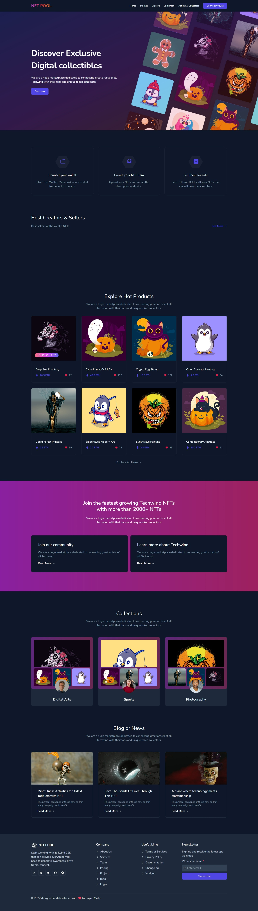

# NFT POOL.
 
 

NFT POOL. is a responsive landing wesite where exchange of NFTs can be done seamlessly

Author : [Sayan Maity](sayancr777@gmail.com)

  

## Built with
   
- **Frontend**: React.JS, TailwindCSS, Vite
- **Version Control**: Git
- **Hosting**: Netlify, Github Pages

## Screenshots 

